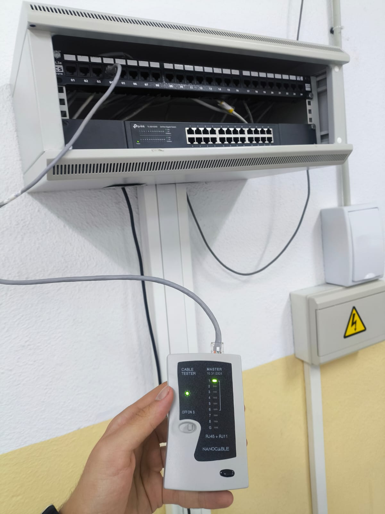
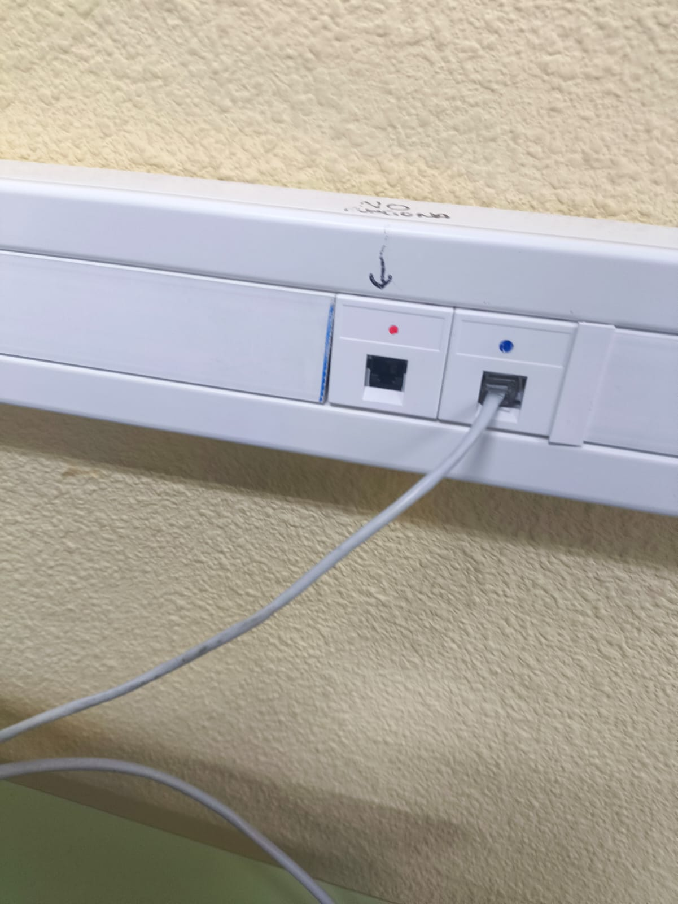
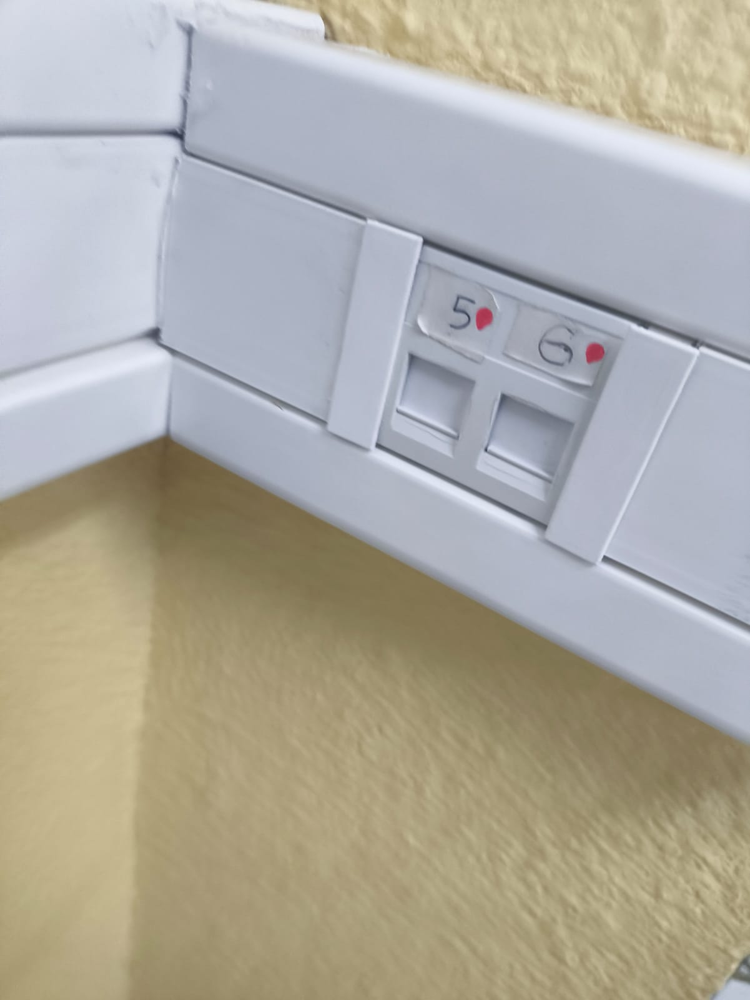
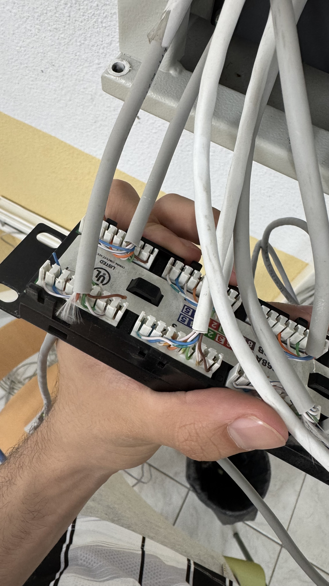
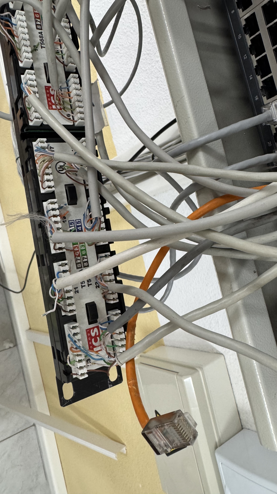
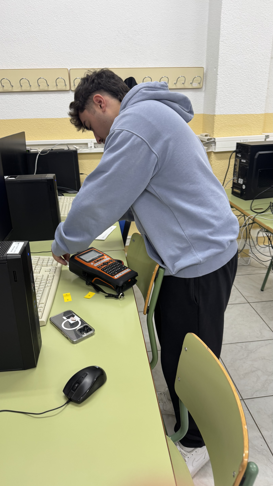
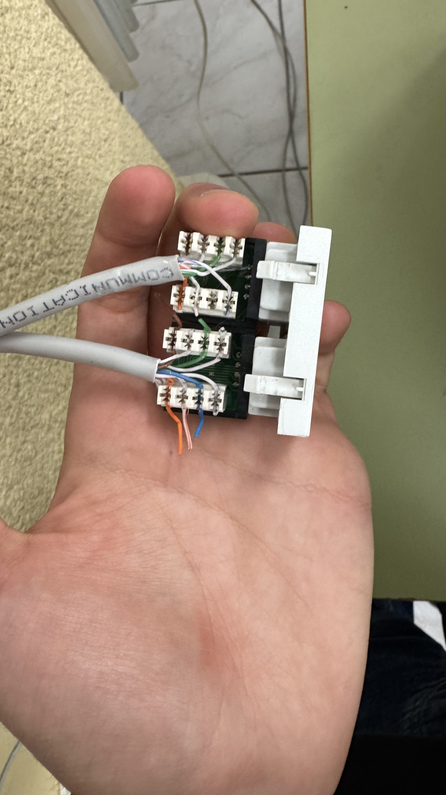
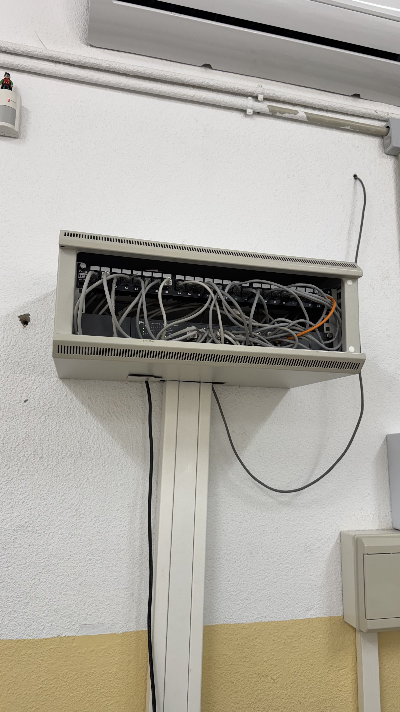

# **Trabajo realizado**

En este apartado se resumen las actividades principales: rehabilitación del cableado de red del 2.º curso de ASIR e implementación del servidor FOG.

## Rehabilitación de la red

- Se inspeccionaron todos los conectores y latiguillos del switch, comprobando continuidad, polaridad y calidad de las terminaciones.
- Se reterminaron y repararon 10 conectores en los puertos 1, 5, 6, 7, 13, 17, 19, 20, 21 y 23. Se reorganizó el tendido, se etiquetaron las canaletas y se documentó la intervención para facilitar el mantenimiento.

Figuras representativas del trabajo de rehabilitación:

### Comprobación en canaletas (vistas)

- Uso de tester para comprobación de continuidad

- Puertos 1 y 2 en canaleta

- Puertos 5 y 6 en canaleta

### Intervención en el backpanel (vistas relacionadas)

- Reparación y reterminado en puertos defectuosos

- Cableado del backpanel tras la intervención

Etiquetado de puertos en canaletas

Reparación de conectores en los extremos

Fabricación de latiguillos a medida para mejorar la presentación

