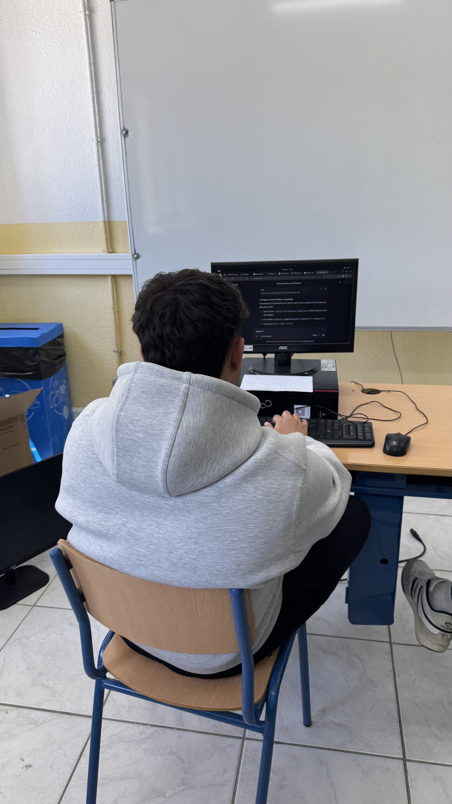
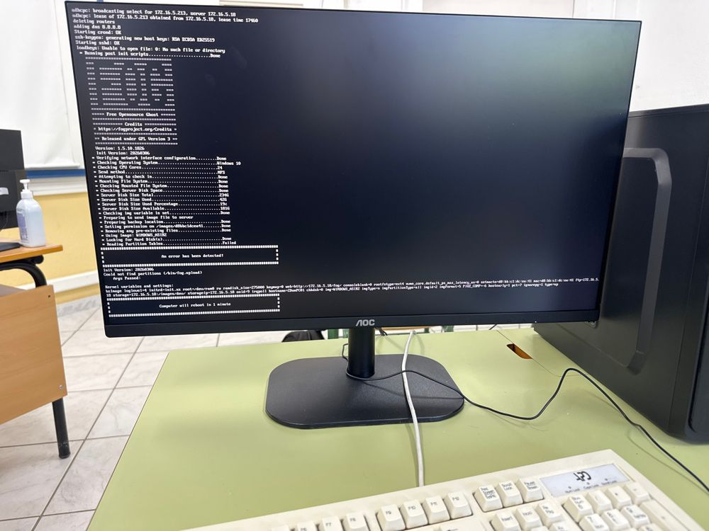
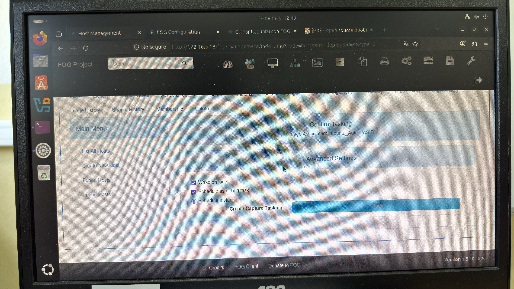

# 2. Implementación del servidor FOG

- Se instaló Ubuntu 26.04 LTS en la máquina destinada a servidor. Después se aplicaron configuraciones básicas de seguridad, como actualizaciones, firewall y la cuenta de servicio ( *fogproject* ), además de los ajustes de red necesarios, entre ellos IP estática y DNS.
- Se instaló y configuró FOG, verificando la comunicación con las máquinas cliente y realizando pruebas iniciales de creación y despliegue de imágenes.

Investigación y configuración inicial del servidor FOG


#############################################

Configuración firewall:

#####################################3

Durante la puesta en marcha aparecieron varios problemas:


Este problema se produjo porque FOG, por defecto, intenta realizar la copia del primer disco que encuentra. Al activar el modo debug en la tarea:


 y ejecutar el comando lsblk se obtuvo lo siguiente:

 

 Como se observa, el primer disco es donde se guardan los datos y el segundo es donde se encuentra el sistema operativo. Esto se debe indicar en el servidor FOG:

 

 En el campo Host Primary Disk se indica el disco del que se quiere hacer la imagen.

 Una vez indicado ya si realiza la imagen:

 

También realizamos 

## 2.1 AnyDesk para la monitorización del servidor FOG
Se realizó la instalación con el siguiente comando:

```bash
wget --max-redirect 1 --trust-server-names 'https://anydesk.com/en/downloads/thank-you?dv=deb_64' -O anydesk.deb &&
sudo apt install ./anydesk.deb
```

Una vez iniciado, al intentar conectarnos desde otro equipo apareció este error, ya que AnyDesk no es compatible con el sistema Wayland:


Se ejecutó lo siguiente:

```bash
sudo apt update &&
sudo apt install xfce4 xfce4-goodies lightdm -y &&  sudo dpkg-reconfigure gdm3
```

En el desplegable se seleccionó lightdm.

Al iniciar sesión, se debe seleccionar la sesión de Xfce:


### Otras configuraciones de AnyDesk

#### Acceso por contraseña

Accedemos a AnyDesk -> Configuración -> Acceso -> Desbloquear el control de seguridad -> Cambiar la contraseña de este puesto de trabajo (se asignó la contraseña "**2Asir**"). Además, se configuró una restricción de acceso para evitar accesos indebidos y se excluyó este equipo de descubrimiento.


### 2.2 Preparación de equipo con Windows y Xubuntu
Se preparó un equipo con dual boot para, posteriormente, realizar la imagen e implementarlo en la clase de 2.º ASIR. Esta práctica tiene como objetivo reducir el tiempo de puesta en marcha de los nuevos cursos, ya que evita tener que configurar los equipos uno a uno.

En este paso también surgieron problemas, ya que el ordenador donde se encontraba el dual boot, al apagarse, no volvió a encender. La fuente de alimentación se probó haciendo el puente entre el pin verde y el negro, pero la placa base no respondía a los botones de encendido. Para solucionarlo, se cambió el disco duro de este equipo a otro. Según la placa base, el problema radicaba en la CPU, aunque se sospecha que la fuente no entrega el voltaje correcto o que existe algún cortocircuito en la placa. No se pudo comprobar en profundidad por falta de tiempo y herramientas:


### 2.3 Añadimos un disco duro al equipo del FOG
El equipo solo disponía de un disco duro de 250 GB, por lo que se instaló otro de 500 GB donde se almacenarán las imágenes generadas a través de FOG:


